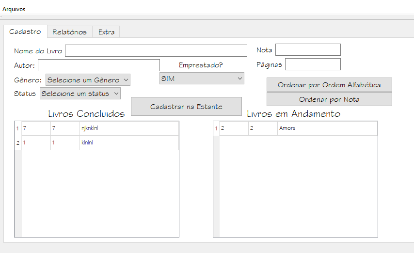
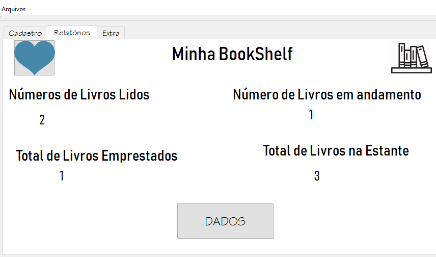
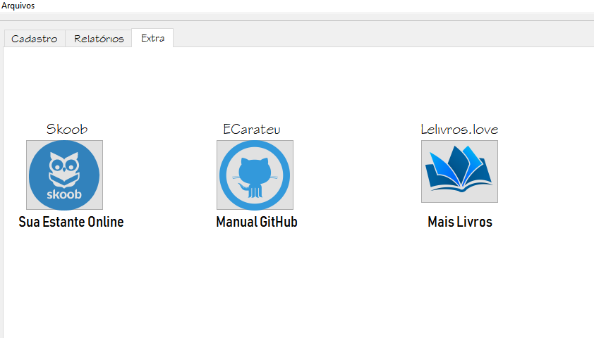
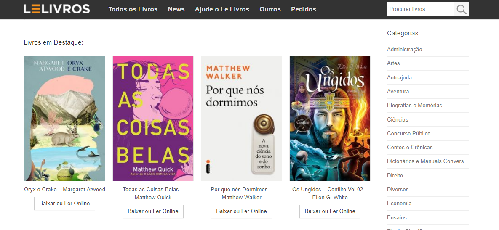

# BookShelf
Projeto feito utilizando Qt Creator (QT), para disciplina de: Técnicas de Programação 2019.1. 

## Sobre o BookShelf:

O **BookShelf** é uma aplicação que ajuda a organizar livros da sua biblioteca pessoal.

## Algumas funções:
* Cadastra seus livros conforme dados fornecidos ;
* Salva Livros que você já leu ;
* Adiciona Livros que você está lendo ;
* Atribui informações sobre gênero, nota, etc...
* Gera algumas estatísticas básicas sobre informações adicionadas ;
* Extra: Acesso direto a sua biblioteca Online pelo Aplicativo Skoob.

## Manual de Utilização

**BookShelf possui um Layout intuitivo, mas vou te ensinar tudinho aqui!** 

## Primeiros Passos:

Voce precisa cadastrar todos os dados sobre seu livro como: nome, nome do autor, numero de páginas...
Quando terminar de preencher todas informações não se esqueça de clickar no botão **Cadastrar na Estante** , ok?

*OBS:, Só  são válidas notas de 1 á 10, e nomes com quantidade de letra superior a 2.*

## Tem como ordenar por nota ou nome de livro:
Seu desejo é uma ordem! Há dois botões na tela principal que possibilitam isso.

## Telinha de Relátorios?

Essa é a parte mais legal do aplicativo! Voce pode administrar e controlar todos os livros da sua estante por:
* Quantidade de Livros 
* Quantidade de Livros Lidos
* Quantidade de Livros Lendo
* Quantidade de Livros Emprestados

*Isso mesmo! Voce também pode salvar seus livros emprestados, na opção na tela inicial **Emprestados**  *

## Extra super fantástico?

Temos! No aplicativo há uma aba que voce pode acessar sua biblioteca virtual online, e tambem um site super legal de Livros!
* Skoob
* Lelivros
* **Nosso incrivel manual!** 

## AHH eu quase que me esquecia!

Temos uma aba pata voce salvar seus livros em um arquivo txt!

# Espero que voce goste!
# BookShelf
# Boa Leitura

